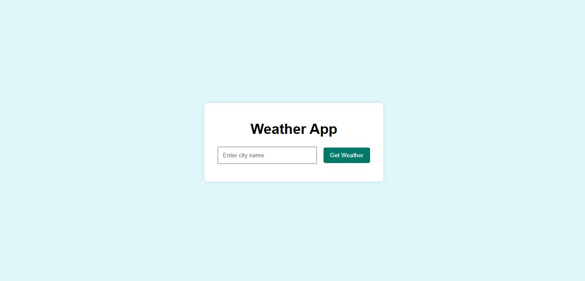

# Weather-Forecasting-Web-App

# Weather Forecasting Web App using OpenWeatherMap API

## About This Project

This is a simple and interactive weather forecasting web app that provides real-time weather information for any city entered by the user. It uses the OpenWeatherMap API to fetch live weather data and displays it using a clean and responsive user interface.

## Live Demo
[Click here to view the live app](https://mdjafarequbal.github.io/Weather-Forecasting-Web-App/)

## Screenshots

### Home Page

### Result Page
![Result(Result.png)

## Features

- Get real-time weather data for any city
- Displays:
  - Temperature (in Celsius)
  - Weather condition (e.g., sunny, cloudy, rain)
  - Humidity percentage
  - Wind speed (m/s)
- Simple and user-friendly interface
- Error handling for invalid city names

## Technologies Used

- **HTML** – for creating the structure of the web page
- **CSS** – for styling the app and making it visually appealing
- **JavaScript** – for adding interactivity and fetching data from the API
- **OpenWeatherMap API** – to get live weather information

## How I Made This Project

1. Designed the layout using HTML and styled it with CSS for a clean and centered user interface.
2. Connected an input box and button that allows users to type a city name and trigger the weather fetch.
3. Used JavaScript’s `fetch()` method to send a request to the OpenWeatherMap API and get weather data based on the city entered.
4. Parsed the API response to extract specific weather details like temperature, description, humidity, and wind speed.
5. Displayed the data dynamically in the browser using JavaScript DOM manipulation.
6. Added error handling to show messages when a city is not found or input is left empty.

